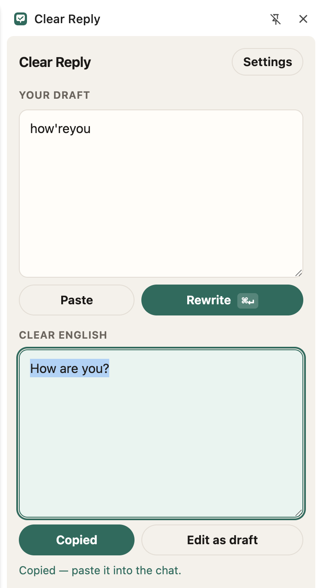

# Clear Reply

Chrome side panel for support agents who write English and want a grammar pass before sending.

<p align="center">
  
</p>

```
chat tab                         side panel
---------                        ----------
copy draft  ──paste/⌘V──▶        your draft
                                 Rewrite ⌘↵
paste reply ◀──auto-copy──       clear English
```

The panel stays open next to the ticket. A popup would close the moment you click back into chat.

## Install

Use the built zip from [Releases](https://github.com/arunkarthik-n/clear-reply/releases/latest) named **clear-reply.zip**. Do not download **Source code** — that zip is for development and will fail in Chrome with a missing `manifest.json` if you load the wrong folder.

1. [Download clear-reply.zip](https://github.com/arunkarthik-n/clear-reply/releases/latest/download/clear-reply.zip).
2. Unzip it. You should see `manifest.json` inside the unzipped folder.
3. Open `chrome://extensions` in Chrome and enable **Developer mode**.
4. Click **Load unpacked** and select **that folder** (the one that contains `manifest.json`).

Chrome only supports one-click installation through the Chrome Web Store. Until Clear Reply is published there, Developer mode is required.

Shortcut: ⌘⇧Y / Ctrl+Shift+Y. Toolbar icon also opens the panel. Right-click selected text → Rewrite with Clear Reply.

### Build from source

```sh
git clone https://github.com/arunkarthik-n/clear-reply.git
cd clear-reply
npm install
npm run build
```

Then **Load unpacked** and select `dist/` (or this repo folder — it has a root `manifest.json` that points at `dist/`).

## Settings

1. Create a key at [console.groq.com/keys](https://console.groq.com/keys).
2. Paste it in the panel's Settings (or the extension options page).
3. Model defaults to `qwen/qwen3.8-27b`. The dropdown lists Groq chat models for that key; any id can be typed.
4. The rewrite system prompt can be edited in Settings.

The key and settings are stored in `chrome.storage.local` on this computer.

## Rewrite contract

Fix grammar. Keep meaning, names, numbers, links. Do not add greetings, promises, or facts that were not in the draft. Output is the reply only — auto-copied so the next paste goes into the customer thread.
